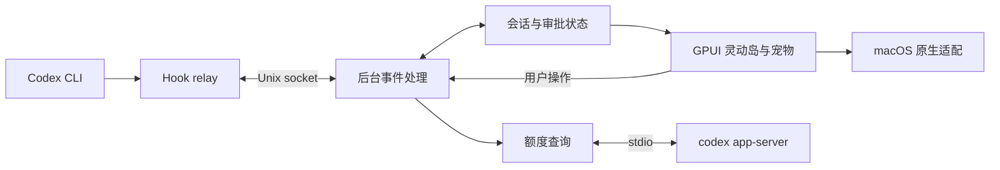

# codex-notch

[toc]

用 Rust 和 GPUI 构建的 macOS 刘海桌面伴侣，复刻 [Coucou](https://github.com/Louis-CFM/coucou) 的视觉与交互，专注于 Codex CLI。

在屏幕顶部查看 Codex 的工作状态、切换会话、处理审批，并让宠物随着任务进度做出反应。继续使用现有 Codex CLI 和官方登录流程。

> 当前处于工程搭建阶段，已初始化 Cargo 工程，尚未实现图形界面。以下功能均为开发目标。

## 项目范围

- 仅支持 macOS，适配带刘海的 MacBook 和没有刘海的显示器。
- 仅接入 Codex CLI，支持同时观察多个会话。
- 界面、宠物外观、动画和交互以上游 Coucou 为参考。
- 个人学习与娱乐项目，当前不发布应用。

## 计划功能

| 功能 | 目标 |
| --- | --- |
| 刘海灵动岛 | 隐藏、悬停露出、点击展开；无刘海时显示顶部浮条 |
| 实时状态 | 展示思考、工具执行、等待审批、完成与错误等状态 |
| 多会话 | 查看各个 Codex 会话的活动与待处理请求 |
| 审批卡 | 一次性允许、拒绝或回到终端处理 |
| 额度展示 | 查看 Codex 用量、额度窗口和重置时间 |
| 终端跳转 | 返回会话所在终端；精确定位能力按终端适配情况提供 |
| 宠物互动 | 呼吸、眨眼、眼神跟随，以及工作、等待、完成等动画 |
| 菜单栏与设置 | 打开灵动岛、配置接入、控制展示与动画、退出应用 |

多模型聊天、第三方服务集成、iPhone 和云同步不属于首期范围。

## 技术方案

| 技术 | 职责 |
| --- | --- |
| [GPUI](https://gpui.rs/) | 界面布局、任务列表、审批卡、设置页、宠物绘制与动画 |
| Rust | 会话状态、事件处理、配置和进程管理 |
| tokio | Unix socket 通信和后台异步任务 |
| serde / serde_json | Hook 事件、IPC 消息和配置的序列化 |
| objc2 / AppKit | 补充菜单栏、刘海屏幕几何和特殊窗口行为等 macOS 能力 |

GPUI 管理窗口和事件循环，macOS 适配层只补充必要的原生能力。界面与后台任务分开，避免通信和额度查询阻塞交互。具体依赖版本将在首次可编译实现时固定。

## 工作方式



Hook relay 转发 Codex 事件，并在审批时返回用户决定。额度通过官方 `codex app-server` 查询。具体 Hook 字段和审批协议需要结合实际 Codex CLI 版本验证。

## 开发进度

- [x] 确定 macOS + Codex CLI 的项目范围
- [x] 确定 GPUI 技术路线
- [x] 调研 Coucou 的窗口、状态机、宠物及 Codex 接入实现
- [ ] 验证 GPUI 透明窗口、顶部定位、焦点、鼠标穿透和多屏行为
- [ ] 实现灵动岛布局、宠物绘制和基础交互
- [ ] 接入 Codex Hooks 与多会话状态
- [ ] 实现审批、额度和终端跳转
- [ ] 完成菜单栏、设置与 macOS 实机验证

目前可以运行基础入口：

```sh
cargo run
```

当前仅输出 `Hello, world!`，尚未添加 GPUI 或接入 Codex。图形界面的构建与使用说明会随实现补充。

## 设计文档

- [GPUI 项目搭建与教学计划](docs/2026-10-08-gpui-learning-plan.md)
- [MVP 架构与模块接口](docs/2026-10-08-coucou-rust-macos-design.md)

该文档是早期设计草案，其中 AppKit 主界面、原创角色及 crate 拆分方案尚未按最新决定更新。当前技术路线以本 README 的 **GPUI 主界面 + 必要的 macOS 原生适配** 为准。

## 致谢

[Louis-CFM / Coucou](https://github.com/Louis-CFM/coucou) 是本项目的功能、视觉和交互参考。原项目代码及素材的许可说明见其 [LICENSE](https://github.com/Louis-CFM/coucou/blob/main/LICENSE) 和 [LICENSE-ASSETS.md](https://github.com/Louis-CFM/coucou/blob/main/LICENSE-ASSETS.md)。
